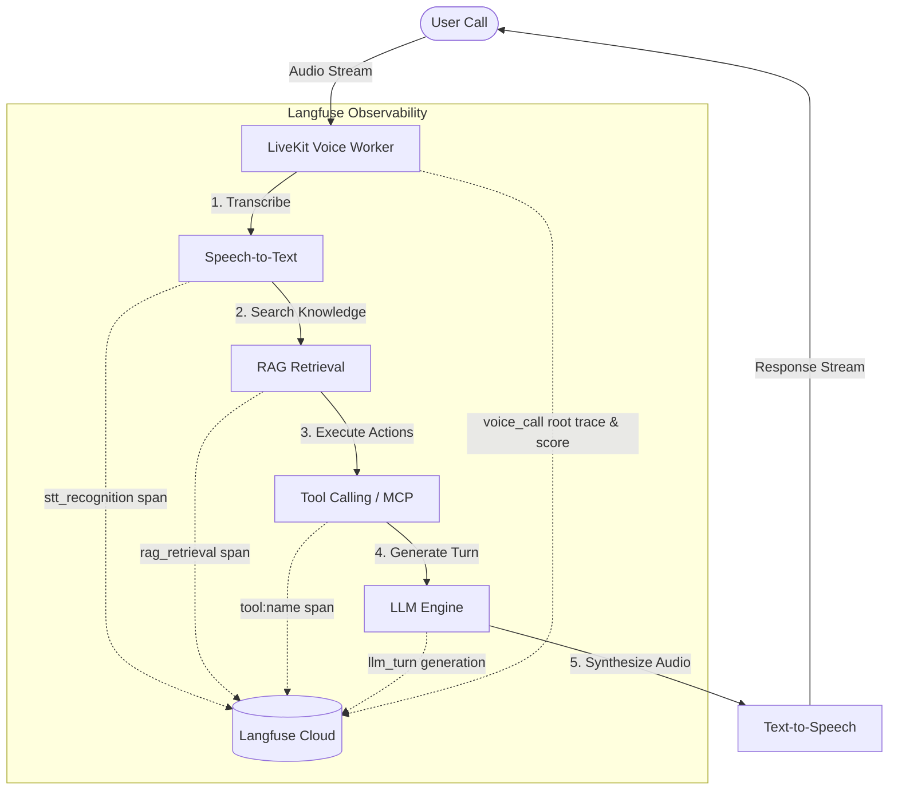

# QuickVoice

**Open-source, enterprise-grade AI phone-agent infrastructure with full Langfuse observability.**

QuickVoice is an open-source phone-agent platform for engineering-led teams that want full control and visibility over their voice-agent stack instead of consuming a closed API. It provides a complete product surface: marketing site, customer console, API server, LiveKit-powered AI worker, telephony integrations (Twilio/Telnyx), knowledge bases (RAG), call logs, outbound campaigns, MCP tool connections, PII privacy controls, and deep observability with **Langfuse**.

Website: [quickvoice.co](https://quickvoice.co)

[](https://github.com/allgpt-co/QuickVoice/stargazers)

---

## Features

- **AI Voice Agent**: Full-duplex conversational voice agents powered by LiveKit Agents, Silero VAD, Deepgram STT, and ElevenLabs/Sarvam TTS.
- **Langfuse Observability**: Deep tracing, span nesting, LLM generation logging, and evaluation scoring for every call turn.
- **STT (Speech-to-Text)**: Real-time audio transcription with model timing and provider latency tracking.
- **RAG (Knowledge Retrieval)**: Context-aware vector searches with match counts, top-k filters, and embedding timing.
- **Tool Calling**: Native execution of HTTP tools and Model Context Protocol (MCP) servers with sanitized input/output logging.
- **LLM Generation**: Prompt and completion logging, token usage tracking, and multi-provider model attribution (AWS Bedrock, Anthropic, OpenAI).
- **Evaluation & Scoring**: Capture call quality scores, user feedback, and evaluation metrics linked directly to trace observations.

---

## Architecture

QuickVoice instruments every phase of a voice conversation turn. The diagram below illustrates the end-to-end pipeline and corresponding Langfuse observation stages:



---

## Langfuse Integration

The QuickVoice AI worker is fully instrumented with the **Langfuse SDK (v4.x)** to capture fine-grained performance and diagnostic telemetry for every call:

```text
Root Trace (voice_call)
├── STT Span (stt_recognition)
├── RAG Span (rag_retrieval)
├── Tool Span (tool:get_user_account)
├── LLM Generation (assistant_greeting)
└── Quality Score (customer_satisfaction)
```

### Key Tracing Capabilities

- **Root Trace**: Each inbound/outbound call initializes a `voice_call` root trace tagged with `call_id`, `agent_id`, `organization_id`, `user_id`, and `provider`.
- **Child Spans**: High-resolution timers (`time.perf_counter()`) measure latency for STT transcription, vector retrieval, and external tool calls.
- **Generations**: Captures exact LLM prompts, completions, model IDs, and token usage (`prompt_tokens`, `completion_tokens`, `total_tokens`).
- **Scores**: Evaluates call quality and records scores (e.g. `customer_satisfaction: 5.0`) linked directly to the trace ID.
- **Metadata**: Attaches environment tags, app version, provider configuration, and PII retention policy (`zero_pii_retention`).
- **Async Flush**: Telemetries are dispatched asynchronously via `flush_async()` (`asyncio.to_thread`) without blocking audio frame processing.
- **Graceful Fallback**: Defensive `try/except` handlers ensure that any network or telemetry failure will never interrupt an active phone call.

---

## Observability

QuickVoice supports complete end-to-end AI observability out of the box:

- **✓ Trace Hierarchy**: Nested root traces, child spans, and generations for complete call visibility.
- **✓ Performance Monitoring**: Microsecond and millisecond latency tracking across STT, RAG, tool calls, and LLM turns.
- **✓ Token Usage & Cost Attribution**: Automated tracking of prompt tokens, completion tokens, and total token usage.
- **✓ Tool Monitoring**: Input, output, execution time, retry count, and error logging for all HTTP and MCP tools.
- **✓ Retrieval Monitoring**: RAG query tracking, match counts, vector search latency, and embedding timing.
- **✓ Score Tracking**: Numerical and categorical scoring for user feedback and LLM evaluation benchmarks.
- **✓ Evaluation**: Complete audit trail for post-call quality review and model performance comparison.

---

## Langfuse Dashboard

### Trace View


### Span Hierarchy


### LLM Generation


### Quality Scores


---

## Quick Start & Configuration

### Prerequisites
- Node.js `>=20.9` and `pnpm@9.0.0`
- Python `3.12`
- Docker with Compose v2

### 1. Environment Setup
Copy template environment files and configure your Langfuse API keys:

```bash
cp apps/ai/.env.dev.example apps/ai/.env.dev
```

Edit `apps/ai/.env.dev` (or `apps/ai/.env.local`):

```env
LANGFUSE_PUBLIC_KEY=<your_public_key>
LANGFUSE_SECRET_KEY=<your_secret_key>
LANGFUSE_HOST=https://cloud.langfuse.com
LANGFUSE_ENABLED=true
```

### 2. Start Local Infrastructure
```bash
docker compose -f docker-compose.dev.yml --env-file .env.dev up -d
```

### 3. Run Database Migrations & Seed
```bash
cd apps/server
npx prisma db push
npx tsx prisma/seed.ts
```

### 4. Run Tracing Verification Script
Verify that your Langfuse credentials, trace creation, span nesting, and flushing work end-to-end:

```bash
cd apps/ai
python scripts/verify_trace.py
```

---

## Project Structure

- `apps/web` — Next.js marketing website and product documentation.
- `apps/console` — Next.js customer management portal for agents, phone numbers, knowledge bases, and call analytics.
- `apps/server` — Express API server for authentication, Prisma ORM, outbound call dispatch, MCP tool execution, and Stripe billing.
- `apps/ai` — Python AI service and LiveKit worker handlers with `LangfuseTracer` integration, STT, RAG, and LLM turn management.
- `packages/eslint-config` & `packages/typescript-config` — Monorepo shared configurations.

---

## License

QuickVoice is licensed under the [GNU Affero General Public License v3.0](./LICENSE).
